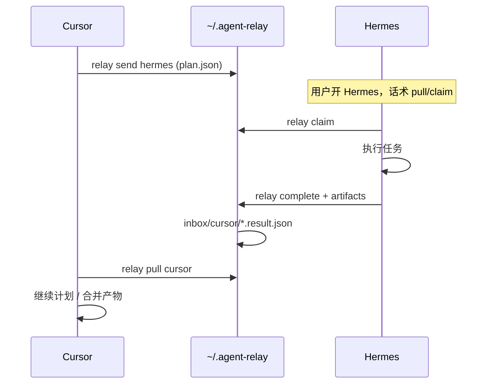

# Architecture

## 设计原则

1. **文件即队列** — 无数据库，任务落盘即可见、可 git、可 rsync
2. **节点无关** — `cursor` / `hermes` 只是目录名，不绑定具体二进制
3. **CLI 与 MCP 同构** — 同一套 core 库，两种入口
4. **可选推送** — v1 拉取（pull）；v2 文件 watcher / 通知

## 目录布局（默认 `~/.agent-relay/`）

```
~/.agent-relay/
  config.yaml          # 本机节点名、路径、可选 webhook
  nodes/               # 已知节点元数据
    cursor.json
    hermes.json
  tasks/
    pending/           # 待认领
      hermes/
        20260607-001.plan.json
    active/            # 已认领执行中
      hermes/
        20260607-001.plan.json
    done/              # 已完成
      hermes/
        20260607-001.plan.json
    failed/
  artifacts/           # 大产物、日志、截图
    20260607-001/
      summary.md
      files.json
  inbox/               # 回传给请求方的消息
    cursor/
      20260607-001.result.json
```

与 `~/.claude-flow/federation/inbox/` **独立**，避免和联邦混淆。

## 组件

```
┌─────────────┐     ┌──────────────┐     ┌─────────────┐
│ Cursor MCP  │     │  relay CLI   │     │ Hermes 话术 │
│ relay_send  │────►│  (Node core) │◄────│ relay pull  │
└─────────────┘     └──────┬───────┘     └─────────────┘
                           │
                    ~/.agent-relay/tasks/
```

### Core（`packages/core` 或 `src/`）

- `createTask({ from, to, plan, acceptance, refs })`
- `claimTask(to, id?)` — 移 pending → active
- `completeTask({ id, summary, artifacts })` — 写 done + inbox/from
- `pullInbox(node)` — 读回传

### CLI（`relay`）

```bash
relay send hermes --plan plan.md --from cursor
relay list hermes --status pending
relay claim hermes                    # 执行方认领最新
relay complete 20260607-001 --summary out.md
relay pull cursor                     # CC 收 Hermes 回传
relay status
```

### MCP（Phase 2）

| Tool | 作用 |
|------|------|
| `relay_send` | 同 `relay send` |
| `relay_pull` | 同 `relay pull` |
| `relay_list` | 列任务 |

挂进 `~/.cursor/mcp.json` 即可；Hermes/Codex 同理。

## 典型序列：CC → Hermes → CC



## 与现有栈的关系

| 现有 | agent-relay |
|------|-------------|
| `ruflo memory` | 可存**指针**（`refs.memoryKeys`），任务正文放 relay |
| `~/.claude-flow/federation/` | **不依赖**；可并存 |
| 四 IDE `CLAUDE_FLOW_CWD` | 不变；relay 用独立 `AGENT_RELAY_HOME` |

## 唤醒策略（分阶段）

| 阶段 | 机制 |
|------|------|
| v0 | 人工在目标 IDE 说「`relay pull` / 读 pending」 |
| v1 | `fswatch` + 桌面通知 / 复制到剪贴板 |
| v2 | 各 IDE 可脚本化入口（Hermes CLI、Codex `codex exec`） |
| v3 | 飞书/Slack 仅作**通知**，执行仍在 relay 目录 |

## 安全

- 本机单用户，文件权限 `0700`
- 任务 JSON 不含密钥；`refs` 只放路径与 memory key
- 可选 `config.yaml` 里 `allowed_nodes` 限制写入方
