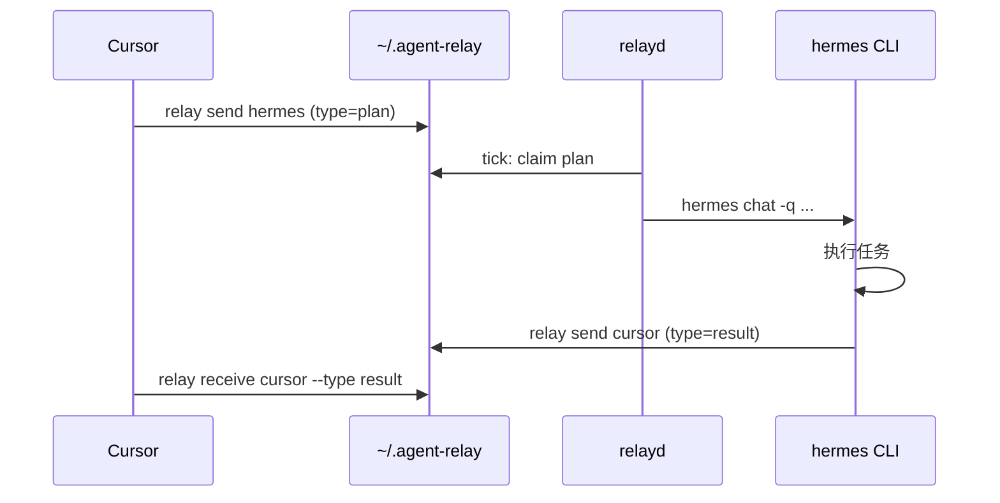

# E2E：cursor → hermes → cursor

v1 主路径（已实测）。成功标准：**一条 send，无需开 Hermes IDE，结果回到 `pending/cursor/`。**

## 前置

```bash
# 接收方
relay setup --role receiver --node hermes --yes

# 发送方（Cursor）
relay setup --role sender --node cursor --yes
# 合并 MCP 后重启 Cursor
```

## 项目路由（可选）

在仓库根目录放 `.agent-relay/project.yaml`：

```json
{ "defaultTo": "hermes", "defaultFrom": "cursor" }
```

之后可省略 `send` 的目标节点：

```bash
relay send --project . --title "任务" --plan-text "## 步骤\n..."
```

## 流程



## 手动验证

```bash
relay send hermes --from cursor --project ~/Projects/foo \
  --title "Fix login" --plan-text "## 步骤\n1. ..."

relay status   # hermes active 应有 1

relay receive cursor --type result
```

## 失败诊断

| 症状 | 查看 |
|------|------|
| relayd 没唤醒 | `~/.agent-relay/relayd.stderr.log` |
| tick 异常 | `~/.agent-relay/relay.log` 搜 `relayd_error` |
| Hermes 未回传 | Hermes 是否配好 API key：`hermes status` |
| MCP 不工作 | 重启 Cursor；检查 `~/.cursor/mcp.json` |

## 成功标准 Checklist

- [ ] `relay send` → `pending/hermes/<id>.json`
- [ ] `relayd` 运行（launchd 或手动 `relayd`）
- [ ] plan → `active/hermes/`
- [ ] Hermes spawn 含 `relay send cursor --type result`
- [ ] 回传在 `pending/cursor/`，`type=result`；plan 归档到 `done/hermes/`
- [ ] `npm test` 全绿（含 `test/e2e-relayd.test.mjs` 闭环）

## 自动化验收

```bash
npm test   # 含 relayd fake-spawn 全链路；当前 62/62
relay health   # orphanPendingPlans 应为 []
relay smoke --project ~/Projects/agent-relay   # live：需 relayd + hermes（约 10–30s）
```

## Live smoke（可重复）

```bash
relay smoke --project ~/Projects/agent-relay --marker "PROD3 OK"
# ok: true → summary 匹配 marker，plan 归档到 done/hermes/
```
